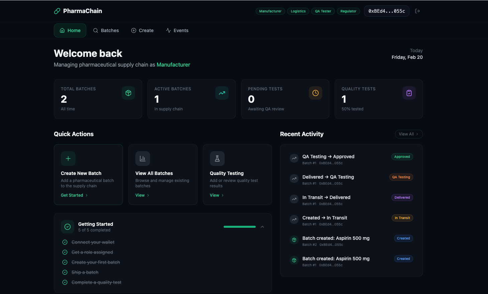

# PharmaChain — Blockchain Pharmaceutical Supply Chain Tracker

An Ethereum-based decentralized application for tracking pharmaceutical batches from manufacture through quality assurance to regulatory approval. Built with Solidity, React, TypeScript, and Hardhat.

### Landing Page


### Dashboard


---

## The Problem

Counterfeit pharmaceuticals are a $200B+ global problem. Traditional supply chains suffer from:

- **Counterfeit infiltration** — forged drugs enter the supply chain through opaque handoff points
- **Broken audit trails** — paper-based or siloed digital records are easy to falsify and hard to verify
- **Opaque supply chains** — stakeholders (regulators, pharmacies, patients) have no real-time visibility into batch status, custody, or temperature history

## The Solution

PharmaChain records every batch lifecycle event on Ethereum, creating an **immutable, transparent, and verifiable** audit trail. Role-based access control ensures only authorized participants can advance batches through the supply chain:

- Manufacturers register batches on-chain
- Logistics providers record custody transfers and temperature data
- QA testers approve or reject batches based on testing outcomes
- Regulators can recall batches at any point in the lifecycle

---

## Architecture

```
┌─────────────────────────────────────────────────────────────────┐
│                        Frontend (React)                         │
│   Landing Page  │  Dashboard  │  Batch Lookup  │  Role Manager  │
└────────────────────────┬────────────────────────────────────────┘
                         │ ethers.js v6
                         ▼
              ┌─────────────────────┐
              │   MetaMask Wallet   │
              │   (Browser Ext.)    │
              └──────────┬──────────┘
                         │ JSON-RPC
                         ▼
              ┌─────────────────────┐
              │   Ethereum Network  │
              │  (Hardhat / Sepolia)│
              └──────────┬──────────┘
                         │
                         ▼
              ┌─────────────────────┐
              │  PharmaChain.sol    │
              │  ┌───────────────┐  │
              │  │ AccessControl │  │
              │  │ ReentrancyGrd │  │
              │  │ State Machine │  │
              │  │ Temp Logging  │  │
              │  └───────────────┘  │
              └─────────────────────┘
```

---

## Smart Contract Design

### Roles

| Role | Constant | Capabilities |
|------|----------|--------------|
| **Admin** | `DEFAULT_ADMIN_ROLE` (`0x00...00`) | Grant/revoke all roles |
| **Manufacturer** | `MANUFACTURER_ROLE` | Create batches, ship to logistics |
| **Logistics** | `LOGISTICS_ROLE` | Confirm delivery, record temperature |
| **QA Tester** | `TESTER_ROLE` | Begin QA testing, approve/reject, record temperature |
| **Regulator** | `REGULATOR_ROLE` | Recall batches from any non-terminal state |

### Batch Lifecycle State Machine

```
                    ┌──────────────────────────────────────────────┐
                    │              REGULATOR RECALL                 │
                    │  (from any non-terminal state)               │
                    └────────────────────┬─────────────────────────┘
                                         │
                                         ▼
  ┌─────────┐    ┌───────────┐    ┌───────────┐    ┌───────────┐    ┌──────────┐
  │ Created ├───►│ InTransit ├───►│ Delivered ├───►│ QATesting ├───►│ Approved │
  │  (0)    │    │   (1)     │    │   (2)     │    │   (3)     │    │   (4)    │
  └─────────┘    └───────────┘    └───────────┘    └─────┬─────┘    └──────────┘
                                                         │
                                                         ▼
                                                   ┌──────────┐
                                                   │ Rejected │
                                                   │   (5)    │
                                                   └──────────┘

  Terminal states: Approved (4), Rejected (5), Recalled (6)
```

### Events

| Event | Indexed Fields | Description |
|-------|---------------|-------------|
| `BatchCreated(uint256 batchId, string drugName, address manufacturer, uint256 timestamp)` | `batchId`, `manufacturer` | Emitted when a new batch is registered |
| `BatchTransitioned(uint256 batchId, Status fromStatus, Status toStatus, address actor, uint256 timestamp)` | `batchId`, `fromStatus`, `toStatus` | Emitted on every state change |
| `TemperatureRecorded(uint256 batchId, int16 temperatureCelsius, address recorder, uint256 timestamp)` | `batchId`, `recorder` | Emitted when a temperature reading is logged |

---

## Frontend Application

### Landing Page
An animated landing page with network canvas, interactive demo explorer, step-by-step workflow visualization, and role cards — displayed when no wallet is connected.

### Dashboard
After connecting MetaMask, users see a unified dashboard with:
- **Home** — Stats cards, quick actions, getting started checklist, recent activity
- **Batches** — Search by batch ID, view full history timeline, perform actions (ship, deliver, test, approve/reject, recall, log temperature)
- **Create** — Register new pharmaceutical batches (Manufacturer/Admin only)
- **Events** — Live on-chain event feed
- **Roles** — Grant and revoke roles (Admin only)

---

## Tech Stack

| Layer | Technology | Purpose |
|-------|-----------|---------|
| Smart Contract | Solidity 0.8.24 | Batch lifecycle, RBAC, temperature logging |
| Contract Framework | Hardhat 2.22.x | Compilation, testing, deployment |
| Security Libraries | OpenZeppelin Contracts 5.4.x | AccessControl, ReentrancyGuard |
| Frontend | React 18 + TypeScript | UI components and state management |
| Build Tool | Vite | Fast HMR development server |
| Styling | TailwindCSS + shadcn/ui | Utility-first CSS with component library |
| Animation | Framer Motion | Scroll-triggered landing page animations |
| Blockchain Interaction | ethers.js v6 | Contract calls, event filtering, wallet integration |
| Wallet | MetaMask | Transaction signing and account management |
| Testing | Chai + Hardhat Network Helpers | 85+ test cases with 100% coverage |

---

## Getting Started

### Prerequisites

- [Node.js](https://nodejs.org/) >= 18
- [MetaMask](https://metamask.io/) browser extension
- npm >= 9

### Install

```bash
git clone https://github.com/stefanjames/secure-pharma-tracker.git
cd secure-pharma-tracker
npm install
```

### Run Locally (3 Terminals)

**Terminal 1 — Start local blockchain:**
```bash
npm run node
```

**Terminal 2 — Deploy contract & assign roles:**
```bash
npm run deploy:local
```

**Terminal 3 — Start frontend:**
```bash
npm run dev
```

Open `http://localhost:5173` in your browser and connect MetaMask.

---

## MetaMask Configuration

To interact with the local Hardhat node:

1. Open MetaMask → Settings → Networks → Add Network
2. Enter:
   - **Network Name:** Hardhat Localhost
   - **RPC URL:** `http://127.0.0.1:8545`
   - **Chain ID:** `31337`
   - **Currency Symbol:** ETH
3. Import a Hardhat test account using one of the private keys printed by `npm run node`

> The `deploy:local` script auto-assigns roles to signers [0]-[4]:
> `[0]` Admin, `[1]` Manufacturer, `[2]` Logistics, `[3]` Tester, `[4]` Regulator

---

## Environment Variables

Copy the example and fill in your values:

```bash
cp .env.example .env
```

```env
# Required for Sepolia deployment
SEPOLIA_RPC_URL=https://eth-sepolia.g.alchemy.com/v2/YOUR_API_KEY
PRIVATE_KEY=0xYOUR_PRIVATE_KEY
ETHERSCAN_API_KEY=YOUR_ETHERSCAN_API_KEY

# Populated after deployment
CONTRACT_ADDRESS=

# Role addresses for grant-roles script
MANUFACTURER_ADDRESS=
LOGISTICS_ADDRESS=
TESTER_ADDRESS=
REGULATOR_ADDRESS=
```

> For local development, no `.env` file is needed — the deploy script generates `frontend/.env` automatically.

---

## Testing

```bash
# Run all tests
npm test

# Run with gas reporting
cd contracts && npx hardhat test --gas-reporter

# Run with coverage
cd contracts && npx hardhat coverage
```

### Test Coverage Areas (85+ tests)

- Deployment & constructor validation
- Role-based access control (grant, revoke, unauthorized access)
- Batch creation (valid inputs, empty name rejection, sequential IDs)
- All valid state transitions (Created → InTransit → Delivered → QATesting → Approved/Rejected)
- All invalid state transitions (wrong source status, wrong holder)
- Recall from every non-terminal state
- Terminal state enforcement (no transitions from Approved/Rejected/Recalled)
- Temperature logging (logistics, testers, unauthorized, int16 boundaries, negative values)
- Edge cases (batchId 0, zero address, unicode strings, modifier ordering)
- ReentrancyGuard verification on all 8 protected functions
- View function boundary conditions

---

## Security Audit

A comprehensive security audit has been performed on the PharmaChain smart contract. Full reports are available in the [`audit/`](./audit/) directory:

- [**71-Point Security Checklist**](./audit/smart-contract-audit-checklist.md) — SWC-aligned checklist across 11 categories
- [**Full Audit Report**](./audit/smart-contract-audit-report.md) — Detailed findings with code snippets and remediations

### Audit Summary

| Severity | Count |
|----------|-------|
| Critical | 0 |
| High | 0 |
| Medium | 2 |
| Low | 2 |
| Gas/Info | 1 |

**Overall: PASS with minor recommendations** — No exploitable vulnerabilities or fund-at-risk issues. See the [audit report](./audit/smart-contract-audit-report.md) for details.

---

## Project Structure

```
pharma-chain-dapp/
├── contracts/
│   ├── contracts/
│   │   └── PharmaChain.sol          # Core smart contract (319 lines)
│   ├── ignition/
│   │   └── modules/
│   │       └── PharmaChain.ts       # Hardhat Ignition module
│   ├── hardhat.config.ts            # Compiler & network config
│   ├── package.json
│   └── tsconfig.json
├── frontend/
│   ├── src/
│   │   ├── components/
│   │   │   ├── landing/
│   │   │   │   ├── LandingPage.tsx   # Landing page wrapper
│   │   │   │   ├── Hero.tsx          # Hero section + NetworkCanvas
│   │   │   │   ├── NetworkCanvas.tsx # Particle mesh animation
│   │   │   │   ├── ProblemSolution.tsx
│   │   │   │   ├── HowItWorks.tsx
│   │   │   │   ├── ChainStats.tsx
│   │   │   │   ├── DemoExplorer.tsx  # Interactive batch demo
│   │   │   │   ├── RoleCards.tsx
│   │   │   │   └── Footer.tsx
│   │   │   ├── ui/
│   │   │   │   ├── button.tsx        # shadcn/ui components
│   │   │   │   ├── card.tsx
│   │   │   │   ├── input.tsx
│   │   │   │   ├── badge.tsx
│   │   │   │   └── toast.tsx
│   │   │   ├── Dashboard.tsx         # Main app shell + nav
│   │   │   ├── DashboardHome.tsx     # Stats, actions, activity
│   │   │   ├── BatchSearch.tsx       # Batch lookup & actions
│   │   │   ├── BatchActions.tsx      # Role-specific batch ops
│   │   │   ├── BatchTimeline.tsx     # Event history timeline
│   │   │   ├── CreateBatch.tsx       # Batch registration form
│   │   │   ├── EventFeed.tsx         # Live event stream
│   │   │   ├── RoleManager.tsx       # Admin role management
│   │   │   └── WalletConnect.tsx     # Wallet button
│   │   ├── hooks/
│   │   │   ├── usePharmaChain.ts     # Contract interaction hook
│   │   │   ├── useWallet.ts          # MetaMask connection hook
│   │   │   └── useToast.ts           # Toast notification hook
│   │   ├── lib/
│   │   │   ├── contract.ts           # ABI, types, constants
│   │   │   ├── PharmaChain.abi.json  # Generated ABI
│   │   │   └── utils.ts              # Utility functions
│   │   ├── App.tsx
│   │   ├── main.tsx
│   │   └── index.css
│   ├── index.html
│   ├── vite.config.ts
│   ├── tailwind.config.js
│   └── package.json
├── scripts/
│   ├── deploy-local.ts               # Local deployment + role setup
│   ├── deploy-sepolia.ts             # Sepolia deployment + verify
│   ├── grant-roles.ts                # Standalone role assignment
│   └── generate-frontend-config.ts   # ABI + .env generator
├── test/
│   └── PharmaChain.test.ts           # 85+ test cases
├── audit/
│   ├── smart-contract-audit-checklist.md
│   └── smart-contract-audit-report.md
├── .env.example
├── .gitignore
└── package.json                      # Root workspace config
```

---

## Deployment

### Local (Hardhat Node)

```bash
npm run node            # Terminal 1: start local blockchain
npm run deploy:local    # Terminal 2: deploy + assign roles
```

The script automatically:
- Deploys PharmaChain to localhost
- Assigns roles to Hardhat signers [0]-[4]
- Writes `frontend/.env` with contract address
- Extracts ABI to `frontend/src/lib/PharmaChain.abi.json`

### Sepolia Testnet

```bash
# 1. Configure .env with SEPOLIA_RPC_URL, PRIVATE_KEY, ETHERSCAN_API_KEY
# 2. Deploy
npm run deploy:sepolia

# 3. Assign roles
npm run grant-roles -- --manufacturer 0x... --logistics 0x... --tester 0x... --regulator 0x...
```

The Sepolia script includes:
- Network guard (rejects non-Sepolia networks)
- Balance check before deployment
- 30-second wait for Etherscan indexing
- Automatic contract verification
- Frontend config generation

---

## Regulatory Context

PharmaChain is designed with awareness of pharmaceutical supply chain regulations:

- **FDA 21 CFR Part 11** — Electronic records and signatures. On-chain events provide tamper-evident audit trails with cryptographic attribution to specific actors.
- **Drug Supply Chain Security Act (DSCSA)** — Requires track-and-trace for prescription drugs in the U.S. PharmaChain's state machine maps directly to DSCSA verification requirements.
- **EU Falsified Medicines Directive (FMD)** — Requires end-to-end verification of pharmaceutical products. Role-based access control ensures only authorized participants interact with batch records.

> **Note:** PharmaChain is a proof-of-concept. Production pharmaceutical tracking systems require additional compliance measures including off-chain data storage, privacy controls, and integration with existing GS1/EPCIS standards.

---

## Future Enhancements

- **Batch metadata** — lot numbers, expiry dates, NDC codes, manufacturing location
- **IPFS integration** — off-chain storage for certificates of analysis, lab reports
- **Multi-sig operations** — require multiple testers to approve high-risk batches
- **Temperature alerts** — on-chain threshold monitoring with automatic notifications
- **Paginated views** — `getTemperatureLogsPaginated()` for batches with extensive monitoring
- **Subgraph indexing** — The Graph integration for efficient historical queries
- **ZK-proof privacy** — hide sensitive batch details while maintaining verifiability
- **Cross-chain bridging** — support for L2 networks (Arbitrum, Optimism) for lower gas costs
- **Mobile app** — React Native companion app with QR code scanning

---

## Author

**Stefan James** — [GitHub](https://github.com/stefanjames)

---

`blockchain` `ethereum` `solidity` `smart-contracts` `supply-chain` `pharmaceutical` `hardhat` `react` `typescript` `tailwindcss` `openzeppelin` `access-control` `dapp` `web3` `defi` `security-audit`
